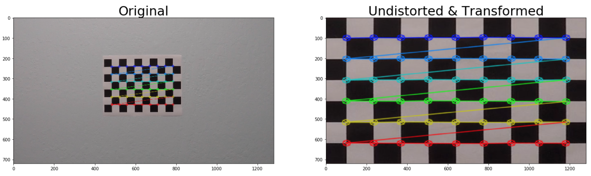
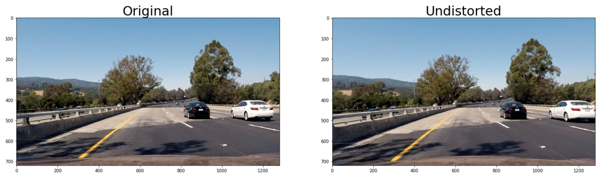
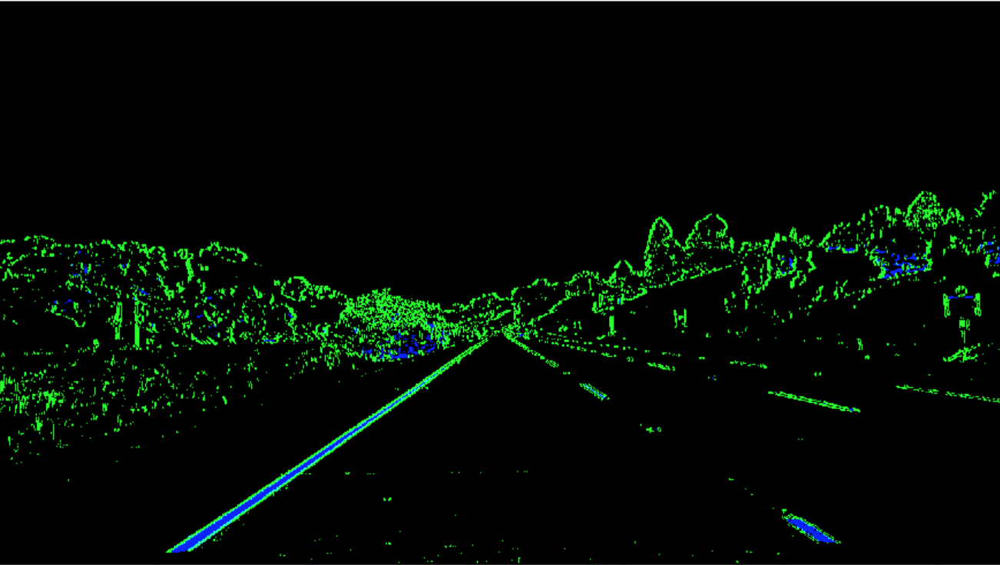
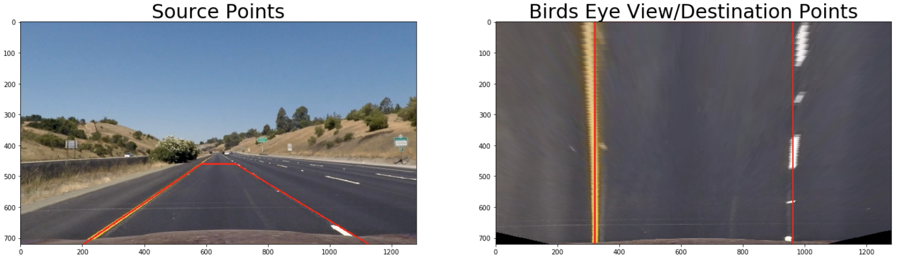
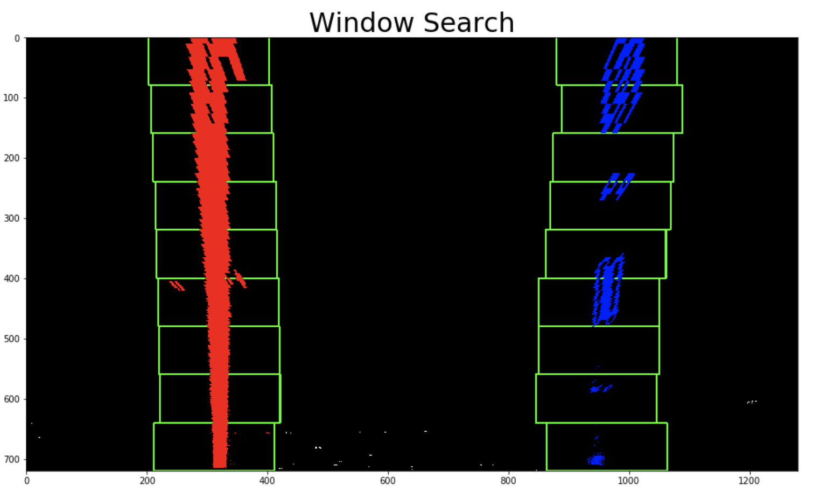
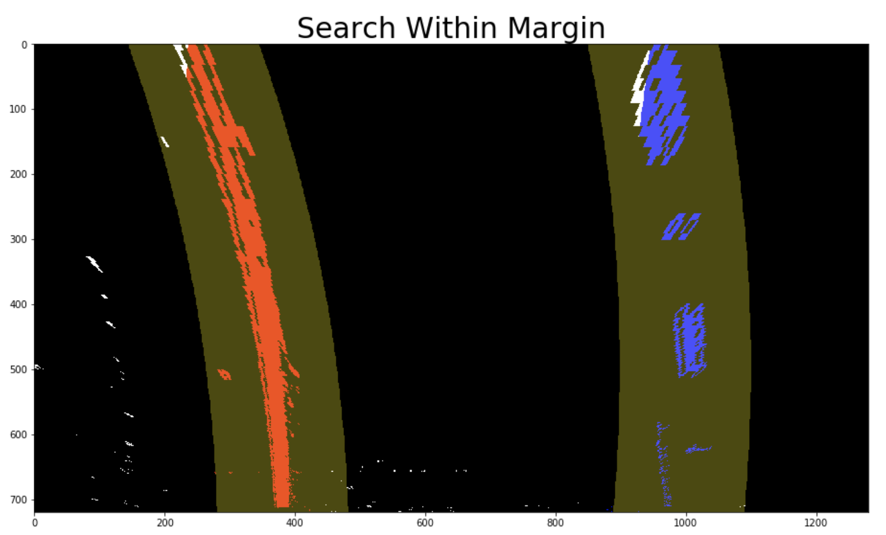
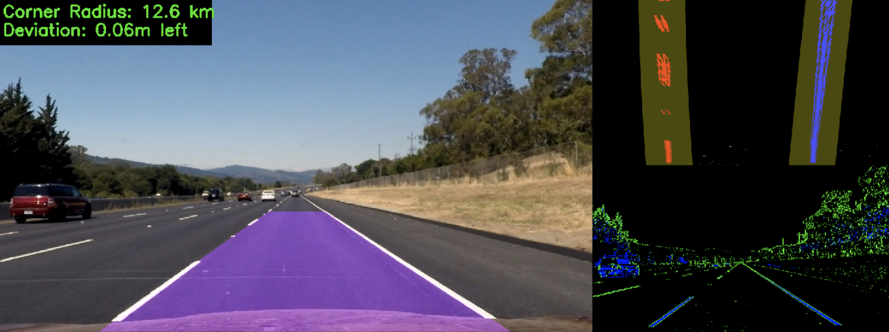

## Writeup Template
[](http://www.udacity.com/drive)
---

**Advanced Lane Finding Project**

The goals / steps of this project are the following:

* Compute the camera calibration matrix and distortion coefficients given a set of chessboard images.
* Apply a distortion correction to raw images.
* Use color transforms, gradients, etc., to create a thresholded binary image.
* Apply a perspective transform to rectify binary image ("birds-eye view").
* Detect lane pixels and fit to find the lane boundary.
* Determine the curvature of the lane and vehicle position with respect to center.
* Warp the detected lane boundaries back onto the original image.
* Output visual display of the lane boundaries and numerical estimation of lane curvature and vehicle position.

[//]: # (Image References)

[image1]: ./examples/undistort_output.png "Undistorted"
[image2]: ./test_images/test1.jpg "Road Transformed"
[image3]: ./examples/binary_combo_example.jpg "Binary Example"
[image4]: ./examples/warped_straight_lines.jpg "Warp Example"
[image5]: ./examples/color_fit_lines.jpg "Fit Visual"
[image6]: ./examples/example_output.jpg "Output"
[video1]: ./project_video.mp4 "Video"

## [Rubric](https://review.udacity.com/#!/rubrics/571/view) Points

### Here I will consider the rubric points individually and describe how I addressed each point in my implementation.  

---

### Writeup / README

### Camera Calibration

#### 1. How was the camera matrix and distortion coefficients computed?

The code for this step is contained in the first three code cells of the IPython notebook located in "./lane_detection.ipynb".

I start by preparing "object points", which will be the (x, y, z) coordinates of the chessboard corners in the world. Here I am assuming the chessboard is fixed on the (x, y) plane at z=0, such that the object points are the same for each calibration image.  Thus, `objp` is just a replicated array of coordinates, and `objpoints` will be appended with a copy of it every time I successfully detect all chessboard corners in a test image.  `imgpoints` will be appended with the (x, y) pixel position of each of the corners in the image plane with each successful chessboard detection.  

I then used the output `objpoints` and `imgpoints` to compute the camera calibration and distortion coefficients using the `cv2.calibrateCamera()` function.  I applied this distortion correction to the test image using the `cv2.undistort()` function and obtained this result:



### Pipeline (single images)

#### 1. Creating a distortion-corrected image.

In order to undistort an image the the camera has to be calibrated. In this example, 20 images were used to calibrate the camera. When calibrated, two variables `mtx`, and `dist` are used to undistort an image.

Using these two variables and OpenCV's cv2.undistort(), the images being passed could be undistorted as shown  here:




#### 2. How was a thresholded binary image created using color transforms and gradients?

A combination of color and gradient thresholds were used to generate a binary image(Cell 6). First, an undistorted image was converted to a HLS color channel and then sliced to receive the S channel which is particularly useful for locating lane lines.

Next, to accentuate the lines away from horizontal, the derivative of the x values were calculated and the absolute value was taken.

Gradient and color thresholds were then used to identify the points making up the left and right lane lines. Once obtained, they were stacked to form one binary image.

Here's an example of the output:



#### 3. Transforming the Binary Image

The code for my perspective transform is situated in cell 7 of line_detection.ipynb (Helper functions are also used which are located in cell 4).

In the transform function the input `binary_img` is used to get the image size which is passed in to two functions get_src() (returns the `src` points) and get_dst() (returns the `dst` points). I chose to hardcode the source and destination points in the following manner:

```python
src = np.float32(
    [[(img_size[0] / 2) - 55, img_size[1] / 2 + 100],
    [((img_size[0] / 6) - 10), img_size[1]],
    [(img_size[0] * 5 / 6) + 60, img_size[1]],
    [(img_size[0] / 2 + 55), img_size[1] / 2 + 100]])

dst = np.float32(
    [[(img_size[0] / 4), 0],
    [(img_size[0] / 4), img_size[1]],
    [(img_size[0] * 3 / 4), img_size[1]],
    [(img_size[0] * 3 / 4), 0]])
```

Using the `src` and `dst` points, the perspective transform could be calculated and was denoted as the variable `M`.

The binary image was then warped and returned a birds eye view perspective of the road.

This resulted in the following source and destination points:

| Source        | Destination   |
|:-------------:|:-------------:|
| 585, 460      | 320, 0        |
| 203, 720      | 320, 720      |
| 1127, 720     | 960, 720      |
| 695, 460      | 960, 0        |

I verified that my perspective transform was working as expected by drawing the `src` and `dst` points onto a test image and its warped counterpart to verify that the lines appear parallel in the warped image.



#### 4. How were the lane-line pixels identified and fit to their positions with a polynomial?

In code cells 8 and 9, the identified lane pixels and their positions were fit with a polynomial.

Cell 8 uses a histogram and sliding window approach. The bases of the lane lines are identified as the two highest peaks of the histogram on either side of the image midpoint. Once the base of the left and right lane is established, a window moves vertically and adjusts based on the average of the previous windows pixel positions.

The pixels within the windows are then fit to a polynomial.

In cell 9 a different approach is used to increase performance which searches within a margin of the previously fitted line instead of searching blindly.

These are images using both methods:






#### 5. How was the radius of curvature of the lane and the position of the vehicle with respect to center calculated?

In cell 10 the curvature of the left and right lane line was calculated as well as the vehicles deviation from the center of the lane.

First the conversions from pixel space to meter was established as follows:

```python
# Conversions in x and y from pixels space to meters
ym_per_pix = 30/720 # meters per pixel in y dimension
xm_per_pix = 3.7/700 # meters per pixel in x dimension
```
Once the bottom y-value had been determined the radius of the left and right lane lines could be calculated as follows:

```python
# Calculation of R_curve (radius of curvature)
left_curve_radius = ((1 + (2*left_fit_cr[0]*y_eval*ym_per_pix + left_fit_cr[1])**2)**1.5) / np.absolute(2*left_fit_cr[0])
right_curve_radius = ((1 + (2*right_fit_cr[0]*y_eval*ym_per_pix + right_fit_cr[1])**2)**1.5) / np.absolute(2*right_fit_cr[0])
```
Next to calculate the cars deviation from the center of the road, the bottom points of the left and right lane was determined as follows:

```python
# Calculate vehicle center
#left_lane and right lane bottom in pixels
left_lane_bottom = (left_fit[0]*y_eval)**2 + left_fit[0]*y_eval + left_fit[2]
right_lane_bottom = (right_fit[0]*y_eval)**2 + right_fit[0]*y_eval + right_fit[2]
```

Lastly, the center of the lane and car deviation was calculated as follows:

```python
def set_lane_center(self, left_lane_bottom, right_lane_bottom):
    """Calculates center of lane from base of left and right lane lines."""
    self.lane_center = (left_lane_bottom + right_lane_bottom)/2.

def set_deviation(self, img_midpoint, xm_per_pix):
    """Set Car Deviation"""
    self.dist_from_center_m = (self.lane_center - img_midpoint)*xm_per_pix #Convert to meters
    self.dist_from_center_px = (self.lane_center - img_midpoint)
```

#### 6. Provide an example image of your result plotted back down onto the road such that the lane area is identified clearly.

After locating the left and right lines in the warped image, cell 11 (function draw_lines()) transforms the warped image back to the original image space using the inverse perspective matrix. The line information was then used to draw the lane onto the image. To provide a smoother lane detection, the average over the last 5 fitted lines was taken and used to draw the lane.

To provide a full visual of the pipeline, the function merge_outputs() in cell 12 was used to display various visuals created throughout the line detection process as shown here:


---

### Pipeline (video)

#### 1. Link to output video.

https://youtu.be/T0_N7x13K-g

---

### Discussion

#### 1. Problems / issues faced in my implementation of this project.  Where does the pipeline fail?  What could be done to make it more robust?

Here I'll talk about the approach I took, what techniques I used, what worked and why, where the pipeline might fail and how I might improve it if I were going to pursue this project further.

In the projects current state it has two methods for searching for lane lines. The first uses a histogram and sliding windows and the second searches within a margin of a polynomial of the previous frame. The second search method runs if the first method has run successfully. The issue is that if the lane lines are list during the margin search, it will be unable to locate the lines again. To correct this, the window search should be run if the lane lines are not found for more than 2-3 frames.

In many scenarios, there are changes in color gradient which will appear as a lane line in the binary image image. Lines like this appear within the true left and right lane lines. Seeing that a lane has a certain width, the width of the predicted lane could be calculated to ensure that the lines are correct.

At this stage, when the image is transformed to birds eye view, it is done with the expectation that the rode is flat. This brought about issues when trying to locate the lines in the harder_challenge_video.
